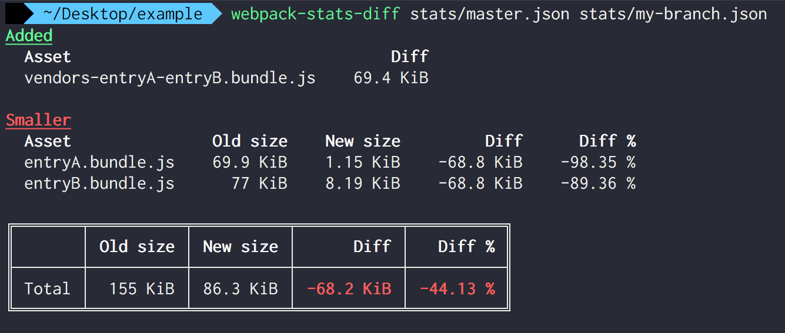

# webpack-stats-diff

A command-line tool to report changes in bundle sizes across builds.

## The problem

You just made changes to your webpack config or your source files and you want to know how bundle sizes were impacted.

## The solution

Use this tool to see how much the total built file size has changed and see the breakdown for what files were added or removed as well as what files increased or decreased in size.

## Installation & Usage

Install with `npm install -g webpack-stats-diff`

To compare your bundle sizes before and after, you'll need to configure webpack to save a stats file. This can be done by either adding a script to your package.json similar to `build_stats: webpack mode=production --json > stats.json` or by adding [webpack-stats-plugin](https://github.com/FormidableLabs/webpack-stats-plugin) into your plugins list.

For example, to compare the bundle sizes between branches, you could save the master build stats to a file `master.json` and the branch build stats to `my-branch.json` and run

```
webpack-stats-diff master.json my-branch.json
```



## Other Solutions

* [webpack-compare](https://github.com/Southpaw17/webpack-compare) instead generates an HTML file to display the comparison, but it doesn't include totals or filtering options.
